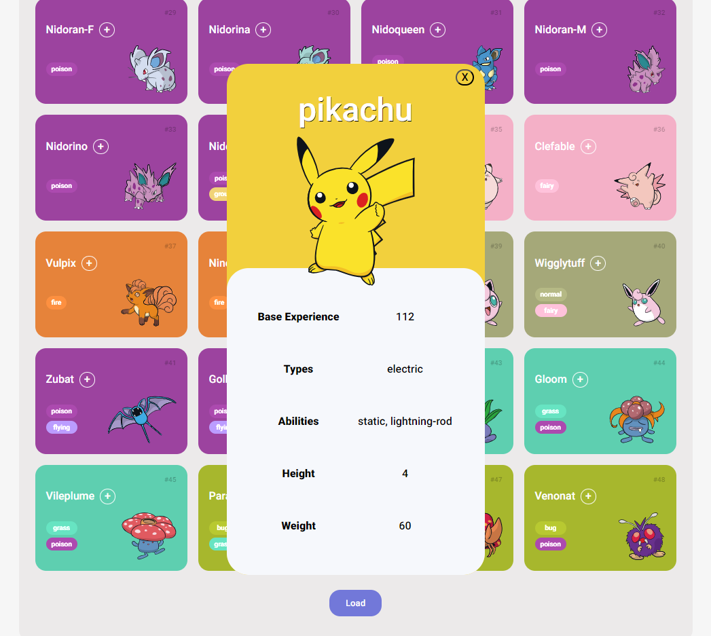

# Lista de Pokémons

## Sobre o Projeto

Projeto desenvolvido durante o Bootcamp do Santander em parceria com a DIO. Trata-se de um app com objetivo de exibir a lista de Pokémons, bem como seus detalhes, com imagens e informações consumidas de uma API externa (https://pokeapi.co/).

### Tecnologias utilizadas:

- HTML 5

- CSS 3

- JavaScript

